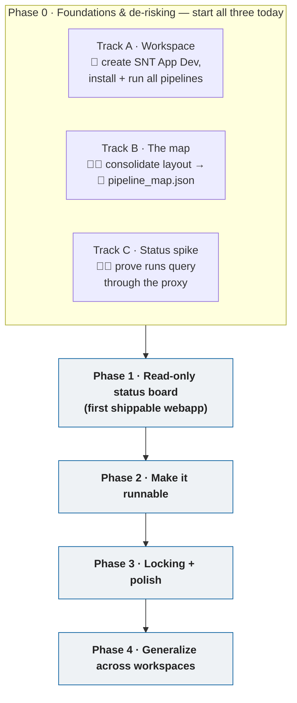
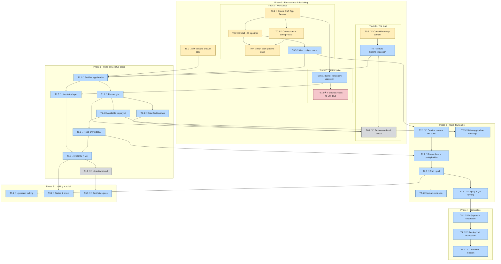

# SNT Orchestrator — Visual Roadmap

> Companion to [PLAN.md](PLAN.md). Same tasks, drawn as flowcharts.
> The diagrams below are [Mermaid](https://mermaid.js.org/) — they render automatically in
> GitHub and in most IDE markdown previewers (VS Code: open this file and press `Ctrl+Shift+V`).
> Edit the code blocks to keep them in sync with PLAN.md.

## Owner legend

| Colour | Owner | |
| --- | --- | --- |
| 🟡 Amber | 🧑 **You** (Giulia) | OpenHEXA actions, map content, reviews |
| 🔵 Blue | 🤖 **Agent** (Claude Code) | Code & JSON, deploy, mirror files |
| ⚪ Grey | 👔 **PM** | UI design input, map validation |
| 🔴 Red | 🛠️ **OH devs** | Platform / MCP / proxy questions |

---

## 1. High-level: phases & the three parallel tracks

Phase 0 splits into three tracks that run **at the same time** and converge on Phase 1.

---

## 2. Detailed: atomic tasks & dependencies

Each box is one atomic task from PLAN.md. Arrows mean **"must finish before."** Colour = owner.

---

## Reading the dependency map

- **The critical path to a shippable Phase 1** runs: `T0.6 → T0.7 → T1.1 → T1.2 → … → T1.7`.
  The map (Track B) is the long pole — start it now.
- **T0.9 (the spike) has only one prerequisite** (a workspace with some runs), so it can go
  first, in parallel, using the existing `snt_testing` workspace.
- **T0.8 reaches back** into Phase 0 from `T1.2`/`T1.3`: you can only eyeball the rendered
  layout once the grid + arrows exist.
